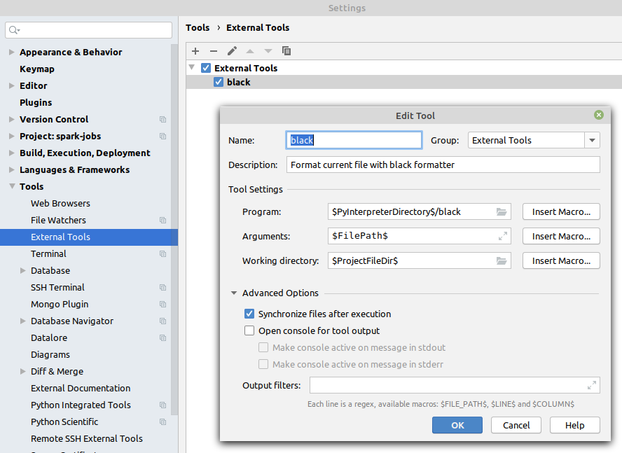
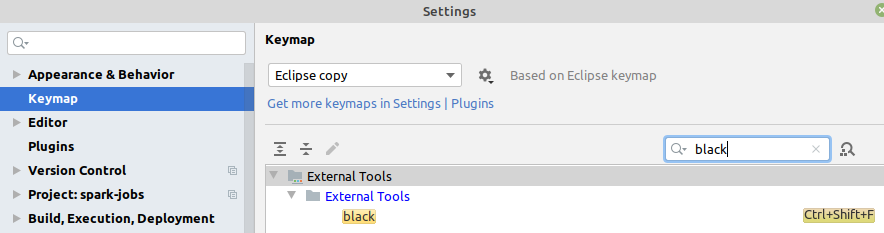

<!--
    How to generate TOC from PyCharm:
    https://github.com/vsch/idea-multimarkdown/wiki/Table-of-Contents-Extension
-->
[TOC levels=1,2 markdown formatted bullet hierarchy]: # "Cookpad Python Style Guide"

# Cookpad Python Style Guide
- [1 Background](#1-background)
  - [1.1 Conventions Precedence](#11-conventions-precedence)
- [2 Python Language Rules](#2-python-language-rules)
  - [2.1 Python Version Support](#21-python-version-support)
  - [2.2 Imports](#22-imports)
  - [2.3 Conditional expressions](#23-conditional-expressions)
  - [2.4 Type Annotations](#24-type-annotations)
  - [2.5 Asynchronous code](#25-asynchronous-code)
- [3 Python Style Rules](#3-python-style-rules)
  - [3.1 Line length](#31-line-length)
  - [3.2 Naming](#32-naming)
  - [3.5 Interfaces](#35-interfaces)
  - [3.6 Comments and docstrings](#36-comments-and-docstrings)
  - [3.7 Exceptions](#37-exceptions)
  - [3.8 Classes](#38-classes)
  - [3.9 Type access](#39-type-access)
- [4 Libraries](#4-libraries)
- [5 Tools](#5-tools)
  - [5.1 pylint (static code analysis)](#51-pylint-static-code-analysis)
  - [5.2 pycodestyle (static code analysis)](#52-pycodestyle-static-code-analysis)
  - [5.3 pydocstyle (static code analysis)](#53-pydocstyle-static-code-analysis)
  - [5.4 black (automatic code formatting)](#54-black-automatic-code-formatting)
  - [5.5 pipenv (virtualenv management and dependency management)](#55-pipenv-virtualenv-management-and-dependency-management)
  - [5.6 pytest (testing)](#56-pytest-testing)
  - [5.7 mypy (static type checks)](#57-mypy-static-type-checks)
  - [5.8 invoke (tasks automation)](#58-invoke-tasks-automation)
- [6 How to Extend This Guide](#6-how-to-extend-this-guide)
  - [6.1 Editing tips](#61-editing-tips)

# 1 Background

Python is a dynamic language used at Cookpad. This style guide is a list of dos and don’ts for Python programs, inspired by the [Google Python Style Guide]. Rather than being a complete guide, this document aims to be a reference where decisions from previous Python style discussions are captured and to resolve ambiguities when they occur.

## 1.1 Conventions Precedence
On occasion, you may encounter a stylistic convention that is covered in a few references. These references may also disagree in their convention. When answering a question of style, please follow the following order of precedence:
1. Project specific conventions (where justified and absolutely necessary, and documented in a project-specific style guide)
2. Cookpad Python Style Guide (this document)
3. [PEP8]
4. [Google Python Style Guide]

Most ambiguities are resolved by using a code formatter and linting rules, detailed in subsequent sections. Avoid (1) if possible to allow
consistent coding experience throughout the company. Prefer to update this document.

# 2 Python Language Rules

Language rules are code choices affecting the code behaviour. Some are enforced by [`pylint`](#51-pylint).

Code choices that don't have any effect on the code execution are documented in the section [3 Python Style Rules](#3-python-style-rules).

## 2.1 Python Version Support

The *highest supported version* is the [latest stable 3.9 Python version](https://www.python.org/downloads/). The *lowest supported version* is 3.6.10.

| Type of codebase     | Version support                                      |
|:---------------------|:-----------------------------------------------------|
| New project          | *highest*, unless prevented by required dependencies |
| Existing project     | the closest possible to *highest*                    |
| New/existing library | all in range \[lowest, highest\]                     |

## 2.2 Imports

* Use absolute imports.
* In case of a name conflict, import the module instead. If the package name conflicts as well, you may rename the import.
* Well known library abbreviations are allowed, if they are documented here.
* Do not use relative names in imports. Even if the module is in the same package, use the full package name. This helps prevent unintentionally importing a package twice.<sup>[G224]<sup>
* Do not use star imports. They pollute the module name space and is very rare to want import of everything.

### 2.2.1 Do :heavy_check_mark:

* Use absolute imports:
  ```python
  import module.sub_module
  from module.sub_module import SomeClass
  ```

* Import module on name conflict:
  ```python
  from module import sub_module_a, sub_module_b
  
  print(sub_module_a.SomeClass)
  print(sub_module_b.SomeClass)
  ```

* Rename import on name and module conflict:
  ```python
  from module.sub_a.module import SomeClass as SomeClassA
  from module.sub_b.module import SomeClass as SomeClassB
  ```

<!-- keep the sorting when adding -->
* Use well known library abbreviation:
  ```python
  import dask.dataframe as dd
  import matplotlib as mpl
  import matplotlib.pyplot as plt
  import pandas as pd
  import seaborn as sns
  import tensorflow as tf
  import torch.nn.functional as F
  ```

### 2.2.2 Don't :heavy_multiplication_x:

* Don't use relative imports:
  ```python
  from .module import sub_module
  from ..module import sub_sub_module
  ```

* Don't use star imports:
  ```python
  from module.sub_module import *
  ```

* Don't use unnecessary renames:
  ```python
  from module.sub_module import SomeClass as SomeOtherClass
  ```

## 2.3 Conditional expressions

Conditional expressions (sometimes called a “ternary operator”) are mechanisms that provide a shorter syntax for if statements.

Okay to use for simple cases. Each portion must fit on one line: true-expression, if-expression, else-expression. Use a complete if statement when things get more complicated.

### 2.3.1 Pros :thumbsup:

Shorter and more convenient than an if statement.

### 2.3.2 Cons :thumbsdown:

May be harder to read than an if statement. The condition may be difficult to locate if the expression is long.

### 2.3.3 Do :heavy_check_mark:

```python
one_line = 'yes' if predicate(value) else 'no'

slightly_split = (
    'yes' if some_long_module.some_long_predicate_function(value)
    else 'no, nein, nyet'
)
the_longest_ternary_style_that_can_be_done = (
    'yes, true, affirmative, confirmed, correct'
    if some_long_module.some_long_predicate_function(value)
    else 'no, false, negative, nay'
)
```

### 2.3.4 Don't :heavy_multiplication_x:

```python
portion_too_long = (
    'yes' if some_long_module.some_long_predicate_function(
        really_long_variable_name
    )
    else 'no, false, negative, nay'
)
```

## 2.4 Type Annotations

You should annotate code with type hints according to [PEP-484](https://www.python.org/dev/peps/pep-0484/), and type-check the code with [mypy](#57-mypy). Because there is no need to support older Python versions that don't understand type annotations, all type annotations must be in source code, not in [comments](#36-comments-and-docstrings), [docstrings](#36-comments-and-docstrings) or [stub `*.pyi` files](https://www.python.org/dev/peps/pep-0484/#stub-files).<sup>[G221]<sup>

Make sure you are familiar with types provided by the [typing](https://docs.python.org/3/library/typing.html) package and you use those, instead of [built-in functions](https://docs.python.org/3/library/functions.html).

### 2.4.1 Pros :thumbsup:

* Type annotations improve the readability and maintainability of your code.
* The type checker will convert many runtime errors to build-time errors.
* Guides towards less complex code (no one wants to write complex annotations).

### 2.4.2 Cons :thumbsdown:

You will have to keep the type declarations up to date. You might see type errors that you think are valid code.

### 2.4.3 Do :heavy_check_mark:

```python
from typing import List, Dict

def func(a: int) -> List[int]:
    dictionary: Dict[str, bool] = {} 
```

### 2.4.4 Don't :heavy_multiplication_x:

* Don't use docstring type annotations:
  ```python
  def func(a):
      """
      Args:
          a (int): Input value.
      Returns:
          List[int]: 10 instance of ``a``.
      """
      ...
  ```

* Don't use type annotations in comments:
  ```python
  dictionary = {}  # type: Dict[str, bool] 
  ```

* Don't use built-in function instead of a type:
  ```python
  def func(a: int) -> list[int]:
      dictionary: dict[str, bool] = {} 
  ```

### 2.4.5 Correct return type for iterators

* When annotating a generator that only `yield`s but doesn't `return` or [`send()`](https://realpython.com/introduction-to-python-generators/#how-to-use-send), use [`Iterator[...]`](https://docs.python.org/3/library/typing.html#typing.Iterator), not [`Generator[...]`](https://docs.python.org/3/library/typing.html#typing.Generator):
  ```python
  from typing import Iterator
  def func() -> Iterator[int]:
      for i in range(10):
        yield i
  ```

### 2.4.6 Include `Optional` for an argument that has a `None` default

If a function's argument defaults to `None`, it should include the `Optional` type annotation. This convention is in accordance with [PEP 484](https://www.python.org/dev/peps/pep-0484/), which specifies "_Type checkers should move towards requiring the optional type to be made explicit_". In type checker parlance, we have opted to follow the so-called ["no implicit optional"](https://github.com/python/mypy/issues/9091) rule.

#### 2.4.6.1 Do :heavy_check_mark::

```python
def create_new_index(self, overide_index_timestamp: Optional[datetime] = None) -> str:
    ...
```

#### 2.4.6.2 Don't :heavy_multiplication_x::

```python
def create_new_index(self, overide_index_timestamp: datetime = None) -> str:
    ...
```

## 2.5 Asynchronous code

Use async code only when you really need it.
-  Async code is more prone to errors - forgetting `await` will often not raise any error in static code analysis because it is valid. It will return a `Future` instead of the expected result.
-  Async code is more difficult to test.

If you use async, make sure you [run tasks concurrently](https://docs.python.org/3/library/asyncio-task.html#running-tasks-concurrently) when possible. Using [`asyncio.gather()`](https://docs.python.org/3/library/asyncio-task.html#asyncio.gather) will cover most cases. There are other functions available if you need finer grained control.

### 2.5.1 Do :heavy_check_mark:

* Use `asyncio.gather()` to call multiple async functions concurrently:
  ```python
  async def load_all(language_code: str, country_code: str):
      await asyncio.gather(
          load_definitions(language_code, country_code),
          load_stopwords(language_code),
          load_negators(language_code),
      )
  ```

* Use `asyncio.gather(*(...))` to call a single async function in a loop concurrently:
  ```python
  async def load_all(language_codes: List[str]):
      await asyncio.gather(
        *(load_definitions(language_code) for language_code in language_codes)
      )
  ```

### 2.5.2 Don't :heavy_multiplication_x:

* Don't use several awaits, unless you want them to be serialized.
  ```python
  async def load_all(language_code: str, country_code: str):
      await load_definitions(language_code, country_code)
      # `load_stopwords` will start only when `load_definitions` has finished
      await load_stopwords(language_code)
      await load_negators(language_code)
  ```
  You may need the calls to be serialized if:
  - Calls are dependent (one uses results of another)
  - You want to limit the resource utilisation (such as not running 300 calls to a single server concurrently)

* Don't call await in a loop, unless you want the calls to be serialized:
  ```python
  async def load_all(language_codes: List[str]):
      for language_code in language_codes:
          await load_definitions(language_code)
          # Next `language_code` will be loaded only when the previous one has finished 
  ```

* Don't use `asyncio.wait()`, unless you want a finer grained control over results/exceptions:
  ```python
  async def load_all(language_code: str, country_code: str):
      # Any exceptions raised in the `load_*` functions below will be ignored
      await asyncio.wait(
          [
              load_definitions(language_code, country_code),
              load_stopwords(language_code),
              load_negators(language_code),
          ]
      )
      
  # The following code will re-raise exceptions, similar to `asyncio.gather`
  async def load_all_with_exceptions(language_code: str, country_code: str):
      done, pending = await asyncio.wait(
          [
              load_definitions(language_code, country_code),
              load_stopwords(language_code),
              load_negators(language_code),
          ]
      )
      assert not pending
      for task in done:
        task.result()
  ```

# 3 Python Style Rules

Style rules are (non-)code choices having no effect on code behaviour. They are enforced by [`pylint`](#51-pylint), [`pydocstyle`](#52-pycodestyle), [`pycodestyle`](#53-pydocstyle) and [`black`](#54-black).

Code choices that do affect code execution are documented in the section [2 Python Language Rules](#2-python-language-rules).

## 3.1 Line length

Maximum line length is 120 characters. Compliance with this line length requirement is taken care of by [`black`](#54-black).

## 3.2 Naming

1. Function names, variable names, and file names should be descriptive; eschew abbreviation. In particular, do not use abbreviations that are ambiguous or unfamiliar to readers outside your project, and do not abbreviate by deleting letters within a word.<sup>[G316]<sup>

2. Python file names must have a .py extension and must not contain dashes (`-`). This allows them to be imported and unit tested.

3. "Internal" means internal to a module, or protected or private within a class.

4. Prepending a single underscore (`_`) has some support for protecting module variables and functions (not included with `from module import *`). While prepending a double underscore (`__` aka "dunder") to an instance variable or method effectively makes the variable or method private to its class (using name mangling) we discourage its use as it impacts readability and testability and isn’t really private. Lint warnings take care of invalid access to protected members.

5. Place related classes and top-level functions together in a module. Unlike Java, there is no need to limit yourself to one class per module. Unless you reach module size limit mandated by the linter.

6. Use `class MyClass` for class names, `my_class.py` for module names.

7. Use `test_my_class.py` for module related unit tests, `class TestMyClass` / `class TestMethodOfMyClass` for grouping related tests and `def should_do_something` for individual tests.

| Type                       | Public                | Internal              |
|:---------------------------|:----------------------|:----------------------|
| Packages                   | `lower_with_under`    |                       |
| Modules                    | `lower_with_under.py` | `lower_with_under.py` |
| Classes                    | `CapWords`            | `_CapWords`           |
| Exceptions                 | `CapWords`            |                       |
| Functions                  | `lower_with_under()`  | `_lower_with_under`   |
| Global/Class Constants     | `CAPS_WITH_UNDER`     | `_CAPS_WITH_UNDER`    |
| Global/Class Variables     | `lower_with_under`    | `_lower_with_under`   |
| Instance Variables         | `lower_with_under`    | `_lower_with_under`   |
| Method Names               | `lower_with_under()`  | `_lower_with_under()` |
| Function/Method Parameters | `lower_with_under`    |                       |
| Local Variables            | `lower_with_under`    |                       |

### 3.2 Names to Avoid

1. 1-2 character names except for counters or iterators. You may use `ex` as an exception identifier in try/except statements and `fd` for file descriptor in with/open statements.
2. dashes (`-`) in any package/module name
3. `__double_leading_and_trailing_underscore__` names (reserved by Python)
4. Package names identical to standard libraries. Example: `test` → `tests`
5. Package names identical to used external libraries. Example: `elasticsearch` → `elastic_search`

### 3.3 Spelling

For source code, use American spelling, not [British spelling](https://aloneonahill.com/blog/if-php-were-british/).

#### 3.3.1 Do :heavy_check_mark:

```python
class Serializer:
    color = 0x00ffffff
```

#### 3.3.2 Don't :heavy_multiplication_x:

```python
class Serialiser:
    colour = 0x00ffffff
```

### 3.4 Unused Function/Method Parameters

Unused argument can be marked as such by deleting the variables at the beginning of the function/method. Always include a comment explaining why you are deleting it. "Unused" is sufficient.

#### 3.4.1 Do :heavy_check_mark:

```python
def viking_cafe_order(spam, beans, eggs, haggis):
    del beans, eggs, haggis  # Unused by vikings.
    return spam + spam + spam
```

#### 3.4.2 Don't :heavy_multiplication_x:

1. Don't use a prefix:
   ```python
   # Breaks callers that pass arguments by name
   def viking_cafe_order(spam, _, unused_eggs, _haggis):
       return spam + spam + spam
   ```
1. Don't assign to `_`:
   ```python
   # Does not enforce that the arguments are actually unused
   def viking_cafe_order(spam, beans, eggs, haggis):
       _ = beans, eggs, haggis
       return spam + spam + spam
   ```

## 3.5 Interfaces

Clearly communicate what is the interface of a class or module by appropriately marking entities as public or internal (see [3.2 Naming](#32-naming)). As a rule of thumb, start with internal and make it public only if you need to.

If certain instance variables are read/write only, use [properties](https://docs.python.org/3/library/functions.html#property) or [setters](https://docs.python.org/3/library/functions.html#property).

In case of data classes, consider making them [immutable/frozen](https://docs.python.org/3/library/dataclasses.html#frozen-instances).

### 3.5.1 Pros :thumbsup:

* The intended use is clearer with less documentation needed.
* Less of unexpected side effects.

### 3.5.2 Do :heavy_check_mark:

```python
_MODULE_CONSTANT = None

class _InternalHelperClass:
    _internal_class_variable = True
    public_class_variable = False


class PublicClass:
    def __init__(self):
        self._internal_instance_variable = _MODULE_CONSTANT

    @property
    def read_only_public_instance_variable(self):
        return self._internal_instance_variable
```

### 3.5.3 Don't :heavy_multiplication_x:

```python
MODULE_CONSTANT = None  # Can be imported

class InternalHelperClass:  # Can be imported
    # internal_class_variable can be changed, not clear it should not
    internal_class_variable = True
    public_class_variable = False


class PublicClass:
    def __init__(self):
        # internal_instance_variable not read-only, not clear it should be
        self.internal_instance_variable = MODULE_CONSTANT

    @property
    def read_only_public_instance_variable(self):
        return self.internal_instance_variable
```

## 3.6 Comments and docstrings

Docstrings are formatted using the Google style (as opposed to reST or numpy), as this is the most readable format. See [an example](https://sphinxcontrib-napoleon.readthedocs.io/en/latest/example_google.html). This format is partially enforced by [`pydocstyle`](#53-pydocstyle).

For docstring and comments format, please refer to the Google Python Style Guide, [section 3.10](http://google.github.io/styleguide/pyguide.html#310-comments-and-docstrings). For documenting types, see [2.4 Type Annotations](#24-type-annotations).

### 3.6.1 Notable conventions

* Use double backticks for code in docstrings:
  ```python
  def method(value):
      """Modifies parameter ``value`` in place."""
      ...
  ```
* Use single backticks for code in comments:
  ```python
  def method(value):
      value += " modified"  # Modifies parameter `value` in place
  ```

## 3.7 Exceptions

<!-- TODO: Linter rule? -->
Exceptions should be full and grammatically correct sentences.

### 3.7.1 Do :heavy_check_mark:

```python
raise ValueError(
    f"Unknown object type {obj.__class__.__name__} for value {obj}. "
    f"Consider adding support for it if acceptable."
)
```

```python
raise NotImplementedError("Expected to be defined in sub-classed.")
```

### 3.7.2 Don't :heavy_multiplication_x:

```python
raise ValueError(
    f"Unknown object type {obj.__class__.__name__} for value {obj}. "
    f"Consider adding support for it if acceptable"  # missing dot
)
```

```python
raise NotImplementedError("expected to be defined in sub-classed")
```

## 3.8 Classes

If a class inherits from no other base classes, do not inherit from object. This also applies to nested classes.

<details>
<summary>Explanation</summary>

There is no need to inherit from `object` in Python 3. This was required in Python 2 to generate new-style classes. Python 3 doesn't have old-style classes anymore, thus there is no difference between classes inheriting from `object` and those which don't.
</details>

### 3.8.1 Do :heavy_check_mark:

```python
class SampleClass:
    pass

class OuterClass:
    class InnerClass:
        pass
```

### 3.8.2 Don't :heavy_multiplication_x:

```python
class SampleClass(object):
    pass

class OuterClass(object):
    class InnerClass(object):
        pass
```

## 3.9 Type access

Access class of an object `obj` via `obj.__class__`, not `type(obj)`.

<details>
<summary>Explanation</summary>

There is [no benefit](https://stackoverflow.com/questions/9610993/python-type-or-class-or-is/9611083#9611083) in using `type` in new-style classes.
</details>

### 3.9.1 Pros :thumbsup:

* More readable than `type(obj)`.

### 3.9.2 Cons :thumbsdown:

* Slightly longer representation.

### 3.9.3 Do :heavy_check_mark:

```python
def dynamic_function(value: str):
    if not isinstance(value, str):
        raise TypeError(f"Unexpected type '{value.__class__.__name__}' used for 'value'")
```

### 3.9.4 Don't :heavy_multiplication_x:

```python
def dynamic_function(value: str):
    if not isinstance(value, str):
        raise TypeError(f"Unexpected type '{type(value).__name__}' used for 'value'")
```

### 3.10 Strings formatting

Prefer [f-strings](https://www.python.org/dev/peps/pep-0498/) over [`str.format`](https://docs.python.org/3/library/stdtypes.html#str.format). Don't use `%` formatting.

There are a few legitimate uses of `str.format`:

* formatting dictionaries
* string templating

### 3.10.1 Do :heavy_check_mark:

```python
f"The value is {value}."  # "The value is 80."
f"{date} was on a {date:%A}"  # "1991-10-12 was on a Saturday"
f"{{{4*10}}}"  # "{ 40 }"
f" [line {lineno:2d}]"
f"{extra},waiters:{len(self._waiters)}"
```

* Formatting a dictionary:
  ```python
  @dataclass
  class Point:
      x: int
      y: int
      
      def __str__(self):
          return "X: {x}, Y: {y}".format(self.__dict__)
  ```

* String templating, template is dynamic:
  ```python
  @dataclass
  class Point:
      x: int
      y: int
      
      def format(self, output_template: str):
          return output_template.format(self.__dict__)

  Point(1, 2).format("X: {x}, Y: {y}")
  ```

* String templating, template is used multiple times:
  ```python
  query_template = "/recipes?query={query}&country_code=GB&provider_id=1"

  client.get(
      query_template.format(query=Faker().sentence()),
      name=query_template.format(query="<RANDOM SENTENCE>"),
  )
  ```

### 3.10.2 Don't :heavy_multiplication_x:

* Don't use `%` formatting:
  ```python
  'error: %s' % msg
  ```

* Don't use unnecessary `str.format`:
  ```python
  "The value is {value}.".format(value=123) 
  ```

### 3.11 Multi-line strings

In multi-line strings, use only regular strings or only f-strings. Combining them often leads to unpopulated placeholders.

### 3.11.1 Do :heavy_check_mark:

* Use regular strings if there is no string formatting needed:
  ```python
  value = (
      "This is an extra long string "
      "wrapped to multiple lines."
  )
  ```

* Use f-strings for string formatting:
  ```python
  value = (
      f"This is an extra long string with a {placeholder} "
      f"wrapped to {count} lines."
  )
  ```

* Use f-strings consistently, even when only some lines need to be formatted:
  ```python
  value = (
      f"This is an extra long string with a {placeholder}. "
      f"This line has no placeholder but should consitently use an f-string."
  )
  ```

### 3.11.2 Don't :heavy_multiplication_x:

* Don't mix regular and f-strings:
  ```python
  value = (
      f"This is an extra long string with a {placeholder} wrapped to "
      "{count} lines. I added the placeholder later and forgot to add the 'f'."
      # ^^^ Oops, this will render "{count} lines"
  )
  ```

# 4 Libraries

The following section describes recommended and commonly used libraries, including conventions for their use.

<!--
TODO: Start each section as "Prefer X in favour of Y or Z (because reasons)."
TODO: Candidates. Please expand if you can think of anything there are more choices and would like to make sure we all use the same one OR there are conventions around certain library that you keep explaining or seeing wrong.
    * Faker: https://faker.readthedocs.io
    * Boltons vs. funcy: https://boltons.readthedocs.io
-->

# 5 Tools

Following section describe recommended and commonly used tools, including conventions for their use.

## 5.1 pylint (static code analysis)

pylint is a tool for finding bugs and style problems in Python source code. It finds problems that are typically caught by a compiler for less dynamic languages like C and C++. Because of the dynamic nature of Python, some warnings may be incorrect; however, spurious warnings should be infrequent.

### 5.1.1 Pros :thumbsup:

Catches easy-to-miss errors like typos, using-vars-before-assignment, etc., therefore faster PRs with fewer comments.

### 5.1.2 Cons :thumbsdown:

`pylint` is not perfect. To take advantage of it, we will need sometimes to:
1. write around it,
2. suppress its warnings,
3. or improve it.

### 5.1.3 Suppressing warnings

Before you start thinking about suppressing warnings, make sure you fully understand the error message and the issue can't be solved in code.

Suppress warnings if they are inappropriate so that other issues are not hidden. To suppress warnings, you use `# pylint: disable=<RULE NAME>`, in this order of preference:
* **line-level:** use for a single disable
* **[block-level](http://pylint.pycqa.org/en/latest/user_guide/message-control.html#block-disables):** use if the same error appears multiple times in a single block or can't be easily disable on the same line
* **file-level:** suggests a larger issue where either the rules need to change or the solution needs a different direction. 

Additionally:
* Use symbolic names to identify `pylint` warnings, not numeric codes.
* Always add an explanation for your disable above or below the suppression.

See also section [3.4 Unused Function/Method Parameters](#34-unused-functionmethod-parameters).

#### 5.1.3.1 Pros :thumbsup:

* Suppressing in this way has the advantage that we can easily search for suppressions and revisit them.
* You may realise you don't need the suppression at all while trying to explain it in the comment ([rubber ducking](https://en.wikipedia.org/wiki/Rubber_duck_debugging)).

#### 5.1.3.2 Do :heavy_check_mark:

```python
# My explanation for this disable
dict = 'something awful'  # pylint: disable=redefined-builtin
```

#### 5.1.3.3 Don't :heavy_multiplication_x:

* Don't use numeric code instead of symbolic:
  ```python
  # My explanation for this disable
  dict = 'something awful'  # pylint: disable=W0622
  ```
  Not clear what is disabled.

* Don't leave out explaining comment:
  ```python
  dict = 'something awful'  # pylint: disable=redefined-builtin
  ```
  Is this disable still needed? What was the motivation?

## 5.2 pycodestyle (static code analysis)

## 5.3 pydocstyle (static code analysis)

## 5.4 black (automatic code formatting)

Black is an opinionated Python code formatter.
<!-- TODO: Add reference to `format` target once it is moved to a shared library. See also section 5.8 (tasks automation). -->

### 5.4.1 Pros :thumbsup:

* Speed, determinism, and freedom from pycodestyle nagging about formatting.
* Saves time and mental energy for more important matters.
* Makes code reviews faster by producing the smallest diffs possible.
* Blackened code looks the same regardless of the project you’re reading.
* Formatting becomes transparent after a while and you can focus on the content instead.

### 5.4.2 Cons :thumbsdown:

* Not everyone will agree with the formatting.
* Manual intervention needed for long strings (black will not wrap them).
* It doesn't and [will not](https://github.com/psf/black/issues/333) order imports. Consider using `isort` for that purpose.

### 5.4.3 Do :heavy_check_mark:

* Run black with `pre-commit` before every push. See the [Tasks Automation](#5.8-invoke-/-tasks-automation) for guidance on combining black with pre-commit.
* Check code into CI if it is formatted.
* Map black to a short cut in your IDE.
  <details>
  <summary>Example for PyCharm</summary>

  Step 1: register external tool
  

  Step 2: register keyboard shortcut for running the external tool
  
  </details>

### 5.4.4 Don't :heavy_multiplication_x:

* Don't use the [magic trailing comma](https://black.readthedocs.io/en/stable/the_black_code_style.html#the-magic-trailing-comma) unless you want to communicate adding more items soon:
  ```python
  # The parameters are not going to change any time soon
  ingredients=[
    {
      "name": "Turkey",
      "quantity": "1",
      "position": 0  # Do not use a comma here
    },
  ]
  ```
* Don't use the editor built-in formatter. While it may do a good job at formatting, it also may not be opinionated. Everyone could have different settings, resulting in different formatting. This difference will result in a lot of unnecessary changes in pull requests by hopping from one style to another.
* Don't use `yapf`. It is just [less popular alternative](https://star-history.t9t.io/#google/yapf&psf/black).

## 5.5 pipenv (virtualenv management and dependency management)

[Pipenv](https://pipenv.pypa.io/en/latest/) automatically creates and manages a virtualenv for projects, as well as adds/removes packages from a `Pipfile` as you install/uninstall packages. It also generates a `Pipfile.lock`, which is used to produce deterministic builds.

<details>
<summary>Q: Why not poetry?</summary>

pipenv was chosen when both pipenv and [poetry](https://python-poetry.org/) were equals. Poetry has evolved since then to have better support. But there wasn't any reason good enough to migrate all project yet. See how they [compare in star rating](https://star-history.t9t.io/#python-poetry/poetry&pypa/pipenv). A future migration could be made easier with [dephell](https://github.com/dephell/dephell).
</details>

<details>
<summary>Q: How to fix versions of the "types-*" modular typeshed packages?</summary>

[Mypy 0.900 brings modular typeshed packages](http://mypy-lang.blogspot.com/2021/05/the-upcoming-switch-to-modular-typeshed.html). This can result in a lot of `types-*` packages in the `Pipfile`. While they all use semantic versioning, vast majority seem to be in the "initial development" (version `0.x`). In semantic versioning, this means that any subsequent version can be breaking (for example `0.1.1` -> `0.1.2`). In case of type packages, breaking means it will start failing type checks where it previously hasn't. This is solved by locking these dependencies to an exact version so that upgrade requires a manual edit of the `Pipfile`. However, doing this for a lot of packages without them actually breaking creates a maintenance overhead.

As a reasonable compromise for maintainability of these packages, set all `types-*` packages to `*` (the latest version), fix to major or exact version only if type check fails.
</details>

### 5.5.1 Pros :thumbsup:

* deterministic builds (as opposed to requirements.txt)

### 5.5.2 Cons :thumbsdown:

* slow (as opposed to poetry, requirements.txt)
* maintenance is almost non-existent

### 5.5.3 Do :heavy_check_mark:

* Lock [semantically versioned](https://semver.org/) stable dependencies (version >= 1.0) to minor version with the [PEP-440 compatible release operator](https://www.python.org/dev/peps/pep-0440/#compatible-release):
  ```text
  pytest = "~=5.4"
  # version 6 will have breaking changes, upgrade should be explicit
  # version 5.5 is not breaking, upgrade can be automatic
  ```
* Lock dependencies that are not semantically versioned or in [initial development](https://semver.org/#spec-item-4) (version 0.x) to a specific version with the [PEP-440 version matching operator](https://www.python.org/dev/peps/pep-0440/#version-matching):
  ```text
  mypy = "==0.790"
  # any new version can be breaking, upgrade mustn't be automatic
  
  respx = "==0.15.0"
  # semantically versioned but any version can be breaking at this stage
  ```
* Leave development dependencies unlocked if breaking changes don't affect anybody:
  ```text
  ipython = "*"
  # you often use ipython in the project but want the latest
  ```
* Leave typeshed packages unlocked, unless it keeps breaking type checks often. If it does, lock to the next least strict version that will prevent the breaking change:
  ```text
  types-requests = "*"

  # version 6.x breaks type checks and we are not ready to move the main
  # package to version 6.x
  types-PyYAML = "~=5.4"
  ```
* Install packages in a reproducible way:
  ```bash
  pipenv install --deploy
  # Aborts if the Pipfile.lock is out-of-date, or Python version is wrong.
  ```

### 5.5.4 Don't :heavy_multiplication_x:

* Don't leave code or testing dependencies unlocked:
  ```text
  pytest = "*"  # could unexpectedly start failing in CI pipeline
  requests = "*"  # could have API change and break the code
  ```

### 5.5.5 Good hygiene for third party packages

As an organisation, we embrace the use of third party open source packages in our software.
Third party software comes with some risks and can be a vector for malicious software attacks. To mitigate risks we recommended following industry best practices.

This section is used to record recommendations for dealing with third party packages, although it is not yet complete. You should follow your own discretion (and industry best practices) when dealing with third party packages. All code authors and code reviewers should take particular care to evaluate new third party packages they are introducing, and also to vet version updates when bumping existing dependencies.

#### 5.5.5.1 Do :heavy_check_mark:

* When updating existing third party dependencies, verify the provenance of each updated version. Use `pipenv update --dry-run` for a list of packages that can be updated. This is to avoid dependency hijack attacks.
* When referring to any package that is not hosted on the official PyPI (Python Package Index), you should explicitly refer to the source index from which the dependency will be imported, using `{..., index="my-index-name"}`. The following example is a Pipfile that is correctly adhering to this rule:
  
  ```toml
  [[source]]
  name = "pypi"
  url = "https://pypi.org/simple"
  verify_ssl = true

  [[source]]
  url = "http://pypi.home.kennethreitz.org/simple"
  verify_ssl = false
  name = "kennethreitz"

  # ...

  [packages]
  "your-favorite-lib" = {version="~=1.0", index="kennethreitz"}  # <-- refers to `kennethreitzth` from the source list
  ```

This will ensure that the package comes from the intended source, rather than a package from PyPI (or any other index on your list of sources) that happens to have the same name. This applies when referring to _any_ non-PyPI index, including internal Cookpad packages hosted on our internal index. A project that fails to follow this rule is at risk of a [dependency confusion attack](https://medium.com/@alex.birsan/dependency-confusion-4a5d60fec610).

## 5.6 pytest (testing)

The pytest framework makes it easy to write small tests yet scales to support complex functional testing for applications and libraries.

### 5.6.1 File System Structure

All tests are expected in a directory called `tests`. This is further subdivided:

* By type of tests:
  * `unit` for unit tests
  * `integration` for integration tests

* By type of code shared among tests of any type:
  * `fixtures` for [pytest fixtures](https://docs.pytest.org/en/latest/fixture.html) shared among different tests
  * `utils` for any extra helper code used exclusively by tests
  * `fakers` for code generating fake instances of objects, usually with [`faker`](https://faker.readthedocs.io)

There should be no nested directories of the same names.

<!-- TODO: Explain the difference between unit and integration test -->

Additionally, all packages must contain an `__init__.py` file to prevent [name clashes](https://github.com/pytest-dev/pytest/issues/3151).

#### 5.6.1.1 Pros :thumbsup:

* Avoids clash with `test`, which is a standard package.
* Predictable locations.
* Allows running tests easily by type or all at once.
* Discourages code duplication

### 5.6.2 Unit Tests Organisation

Directory structure under `tests/unit` replicates directory structure of the source package. Test file is the same as the file it tests, with a `test_` prefix.

If the test file grows too large, it may be an indicator or either missing [parametrization](#565-tests-parametrization) or the source module doing too much. Try to introduce [parametrization](#565-tests-parametrization) or split the source code first.

#### 5.6.2.1 Pros :thumbsup:

* Allows easier finding of relevant tests.

#### 5.6.2.3 Do :heavy_check_mark:

For the following source package:
```text
src/
    package/
        module.py
```

* Test file matching source file
  ```text
  tests/
      unit/
          package/
              test_module.py
  ```

#### 5.6.2.4 Don't :heavy_multiplication_x:

For the same source package as in [Do](#5623-do-heavy_check_mark)'s:

* Don't use mismatching path:
  ```text
  tests/
      unit/
          test_module.py
  ```
* Don't leave out split by type:
  ```text
  tests/
      module/
          test_module.py
  ```

* Don't use unpredictable file names:
  ```text
  tests/
      unit/
          package/
              test_multiple_modules_in_one_file.py
  ```

### 5.6.3 Integration Tests Organisation

Unlike [unit tests](#562-unit-tests-organisation), integration tests don't relate to a specific file . Therefore, the directory structure under `tests/integration` should centre around features. All files must use the `test_` prefix.

### 5.6.4 Test File Organisation

Always put a test in a class, even though pytest does not mandate it. Name the class after the thing you test. It can be a class, a feature, etc. The class must start with `Test`.

Start test cases with `should_` rather than `test_`. The test case should require no docstring. All the information should fit in the method name.

The class name, method name and test parameters (if used) should for a sentence.

#### 5.6.4.1 Pros :thumbsup:

* Readable test output - it makes sense without additional context.
* Guides towards small, focused tests because of thinking "I'm testing something. It should do something."
* Focuses on features rather than line coverage.

#### 5.6.4.2 Cons :thumbsdown:

* Tests often need to be static methods because `self` is not used.

#### 5.6.4.3 Do :heavy_check_mark:

Test of function `datetime_to_iso_zulu` from `utils.py` in `test_utils.py`.

```python
class TestDatetimeToIsoZulu:
    @staticmethod
    def should_convert_datetime_to_utc_string():
        assert ...

    @staticmethod
    @pytest.mark.parametrize(
        "instance", [
            pytest.param(datetime.now(), id="datetime without timezone"),
            pytest.param(None, id="None"),
        ]
    )
    def should_refuse():
        assert ...
```

This will generate tests:
* `test_utils.TestDatetimeToIsoZulu.should_convert_datetime_to_utc_string`
* `test_utils.TestDatetimeToIsoZulu.should_refuse.datetime without timezone`
* `test_utils.TestDatetimeToIsoZulu.should_refuse.None`

#### 5.6.4.4 Don't :heavy_multiplication_x:

* Don't leave out a class:
  ```python
  def test_convert_datetime_to_utc_string():
      assert ...
  ```
  Test of what?

* Don't name test cases poorly:
  ```python
  def test_1():
      assert ...
  ```
  Can you tell what was supposed to happen if it fails?

### 5.6.5 Tests Parametrization

Prefer to parametrize test cases with `pytest.mark.parametrize` instead of copy and pasting them. Additionally, make sure each example has a readable ID by using `pytest.param(..., id="…")`. Default ones are rarely readable. See also section [5.6.4 Test File Organisation](#564-test-file-organisation).

<details>
<summary>Tips</summary>

If you're not sure what are the test parameters:
1. Start with a copy of the test case
2. Change the copy
3. See where they differ
4. Refactor into a single parametrized test case
</details>


#### 5.6.5.1 Pros :thumbsup:

* Decreased maintenance cost due to reduced duplication
* Readable test output

#### 5.6.5.3 Do :heavy_check_mark:

```python
class TestDatetimeToIsoZulu:
    @staticmethod
    @pytest.mark.parametrize(
        "instance", [
            pytest.param(datetime.now(), id="datetime without timezone"),
            pytest.param(None, id="None"),
        ]
    )
    def should_refuse(instance: Any):
        assert ...
```

#### 5.6.5.4 Don't :heavy_multiplication_x:

* Don't use the same assertions in multiple tests, unless the function bodies are too different:
  ```python
  class TestDatetimeToIsoZulu:
      @staticmethod
      def should_refuse_datetime_without_timezone():
          assert ...
      
      @staticmethod    
      def should_refuse_none():
          assert ...
  ```

* Don't use default example IDs:
  ```python
  class TestDatetimeToIsoZulu:
      @staticmethod
      @pytest.mark.parametrize("instance", [[datetime.now()], [None]])
      def should_refuse(instance: Any):
          assert ...
  ```

* Don't parametrize values that don't change:
  ```python
  class TestDatetimeToIsoZulu:
      @staticmethod
      @pytest.mark.parametrize(
          "instance,key", [
              pytest.param(datetime.now(), "key_name", id="datetime without timezone"),
              pytest.param(None, "key_name", id="None"),
          ]
      )
      def should_refuse(instance: Any, key: str):
          # `key` is identical in all examples 
          assert getattr(obj, key)
  ```

* Don't parametrize if there is just one example, unless you expect more in the next bulk of work:
  ```python
  class TestDatetimeToIsoZulu:
      @staticmethod
      @pytest.mark.parametrize(
          "instance", [
              pytest.param(datetime.now(), "key_name", id="datetime without timezone"),
          ]
      )
      def should_refuse(instance: Any):
          assert ...
  ```

### 5.6.6 Signposting in Tests

<!-- TODO: Add link to explanation of integration tests -->
Tests and especially integration tests can be complex. It may not be evident from reading the code what is the setup, run and the actual test. If the test is more than a couple of lines, consider adding signpost comments borrowed from the [Gherkin syntax](https://behave.readthedocs.io/en/latest/philosophy.html#the-gherkin-language): `GIVEN`, `WHEN`, `THEN`

Don't use the full Gherkin syntax though. If you have a need to explain a complicated test, prefer doing so using descriptive variables and/or functions. Only if it doesn't help, use regular (block) [comments](#36-comments-and-docstrings).

#### 5.6.6.1 Pros :thumbsup:

* Better structured tests because of thinking in term of given-when-then.

#### 5.6.6.3 Do :heavy_check_mark:

```python
def should_give_lower_rating_to_recipes(
    self, es_client: Elasticsearch, recipe_index: str, attribute: str, value: Any
):
    # GIVEN
    worse_recipe = _matching_recipe()
    setattr(worse_recipe, attribute, value)
    recipe_ids_in_relevance_order = _index_recipes(es_client, recipe_index, [_matching_recipe(), worse_recipe])
    
    # WHEN
    response = CLIENT.get("/recipes", params=self.REQUIRED_QUERY_PARAMS)
    
    # THEN
    assert response.status_code == HTTP_200_OK, response.text
    
    recipe_response = RecipeResponse(**response.json())
    assert [
        result.id for result in recipe_response.result
    ] == recipe_ids_in_relevance_order, "Exactly 2 IDs were expected in this order."
```

#### 5.6.6.4 Don't :heavy_multiplication_x:

* Don't leave long tests without signposting:
  ```python
  def should_give_lower_rating_to_recipes(
      self, es_client: Elasticsearch, recipe_index: str, attribute: str, value: Any
  ):
      worse_recipe = _matching_recipe()
      setattr(worse_recipe, attribute, value)
      
      recipe_ids_in_relevance_order = _index_recipes(es_client, recipe_index, [_matching_recipe(), worse_recipe])
      
      response = CLIENT.get("/recipes", params=self.REQUIRED_QUERY_PARAMS)
      
      assert response.status_code == HTTP_200_OK, response.text  
      recipe_response = RecipeResponse(**response.json())
      assert [
          result.id for result in recipe_response.result
      ] == recipe_ids_in_relevance_order, "Exactly 2 IDs were expected in this order."
  ```

* Don't use signposting when each section is one statement or evident:
  ```python
  def should_accept_page_number(self):
      # GIVEN
      page = 1
      
      # WHEN
      response = CLIENT.get("/recipes", params={"page": page})
      
      # THEN
      assert response.status_code == HTTP_200_OK, response.text
  ```

* Don't use the full Gherkin syntax:
  ```python
  def should_give_lower_rating_to_recipes(
      self, es_client: Elasticsearch, recipe_index: str, attribute: str, value: Any
  ):
      # GIVEN I have a recipe with default values
      # AND I create a recipe with one stat worse
      worse_recipe = _matching_recipe()
      setattr(worse_recipe, attribute, value)
      
      # AND I index both recipes in the relevance order I expect to get them back
      recipe_ids_in_relevance_order = _index_recipes(es_client, recipe_index, [_matching_recipe(), worse_recipe])
      
      # WHEN I make a request
      response = CLIENT.get("/recipes", params=self.REQUIRED_QUERY_PARAMS)
      
      # THEN the request is successful
      assert response.status_code == HTTP_200_OK, response.text
      
      # AND IDs order matches the expected relevance order
      recipe_response = RecipeResponse(**response.json())
      assert [
          result.id for result in recipe_response.result
      ] == recipe_ids_in_relevance_order, "Exactly 2 IDs were expected in this order."
  ```

## 5.7 mypy (static type checks)

## 5.8 invoke (tasks automation)

Prefer to use [invoke](http://www.pyinvoke.org/) framework for tasks automation. Invoke is a Python task execution tool & library, drawing inspiration from various sources to arrive at a powerful & clean feature set.

<details>
<summary>Q: Can I use Invoke tasks in pre-commit?</summary>

Yes you can. See the following `.pre-commit-config.yaml` file example for running a `format` task that executes the [`black`](#54-black) formatter through [`pipenv`](#55-pipenv):

```yaml
repos:
- repo: local
  hooks:
    - id: formatting
      name: formatting
      stages: [commit]
      language: system
      pass_filenames: false
      require_serial: true
      entry: pipenv run inv format
      types: [python]
```
</details>

### 5.8.1 Pros :thumbsup:

* Deduplication of tasks (similar to Makefile)
* Removes a lot of complexity from running processes from Python - input/output handling, command line options parsing
* No new language knowledge needed
* Easy to learn

### 5.8.2 Cons :thumbsdown:

* Harder to debug than plain Python script

### 5.8.3 Do :heavy_check_mark:

* Use the same name for tasks with the same purpose across multiple repositories. It reduces cognitive overhead when switching between repositories.

  ```bash
  cd apps/sparks-jobs
  invoke verify-all
  cd ../recipe-search-svc
  invoke verify-all
  ```
  <!-- TODO: Replace list of standard tasks with a link once they are moved to a shared library. -->
  Standard task names: `build`, `format`, `lint`, `lint-docstyle`, `lint-pycodestyle`, `lint-pylint`, `test-all`, `test-integration`, `test-unit`, `typecheck`, `verify-all`. Task names should be in kebab case.

### 5.8.4 Don't :heavy_multiplication_x:

* Don't rename tasks if not needed. Simply name the function as the task if possible:
  ```python
  @task(name="lint-docstyle")  # can be just `@task`
  def lint_docstyle(ctx, environment):
    ...
  ```

* Don't use other task automation technologies if possible:
  * `Script` section of `Pipfile` - no benefit over calling invoke directly.
  * Ad-hoc Python scripts - there is no common interface.
  * Makefiles or Bash scripts - not everyone knows them on sufficient level to be able to fully understand them or write them well.
  * Fabric - Invoke is used already in many repositories. Using a single framework for tasks automation has lower cognitive overhead.

# 6 How to Extend This Guide

This is a live document and everyone is welcome to improve it. Feel free to open a PR in this repository to suggest changes or gather feedback.  

## 6.1 Editing tips

* Prefer adding content to end of sections to prevent broken links and tedious relabeling of all subsequent sections.
* Do include section numbering (e.g. `2.4.3.1`) in the section title for _do_ and _don't_ items. These headings generate anchors that can be used in PRs to link to the particular example directly. Without a section numbering, it won't have a unique anchor.
* There is a section template at the end of this document, hidden in a block comment. It has a lot of TODO comments to help you capture all information in a consistent style.

<!--
########################################################################
# START OF TEMPLATE: You can copy this section and it's sub-sections.  #
########################################################################

## 8.1 <TOPIC NAME>

TODO: Description of the problem and desirable solution.
TODO: Leave longer code examples for the "Do" and "Don't" sections. Inline are fine.
TODO: Numbering of sections is correct.
TODO: Source is quoted (see section 1.2).
TODO: The following sub-sections are used only if needed.
TODO: Split a section into smaller sub-sections if needed (see 3.2 for an example).

TODO: Optional explanation of why this convention is in place.
<details>
<summary>Explanation</summary>

TODO: Add details here.
TODO: Keep an empty line above.
</details>

TODO: Optional Q&A that happened around this subject.
<details>
<summary>Q: INSERT QUESTION</summary>

TODO: Add answer here.
TODO: Keep an empty line above.
</details>

### 8.1.1 Pros :thumbsup:

TODO: Heading level matches the nesting (8.1.1 -> ###, 8.5.1.1 -> ####).
TODO: Section numbers match parent section (4.3 -> 4.3.1).
TODO: Describe the advantages of this approach.

### 8.1.2 Cons :thumbsdown:

TODO: Describe the disadvantages of this approach.

### 8.1.3 Do :heavy_check_mark:

TODO: One or more examples of how a good solution looks like, each in individual code block. Annotate the code with comments if needed.
TODO: The description of an example reads as a sentence after "Do …".
TODO: The description of an example ends with a colon ":".
TODO: Either all examples have a description or none have it.

```python

```

### 8.1.4 Don't :heavy_multiplication_x:

TODO: One or more examples of how an undesirable solution looks like, each in individual code block. Annotate the code with comments if needed.
TODO: The description of an example starts with "Don't" and ends with a colon ":".
TODO: Either all examples have a description or none have it.

* Don't …:
  ```python

  ```

* Don't …:
  ```python

  ```

########################################################################
# END OF TEMPLATE                                                      #
########################################################################
-->

<!-- Quotation links in numerical order. Use as `<sup>[Gxxx]</sup>`. -->
[G221]: http://google.github.io/styleguide/pyguide.html#221-type-annotated-code
[G224]: http://google.github.io/styleguide/pyguide.html#224-decision
[G316]: http://google.github.io/styleguide/pyguide.html#316-naming

<!-- Other common links -->
[PEP8]: https://www.python.org/dev/peps/pep-0008/
[Google Python Style Guide]: http://google.github.io/styleguide/pyguide.html
